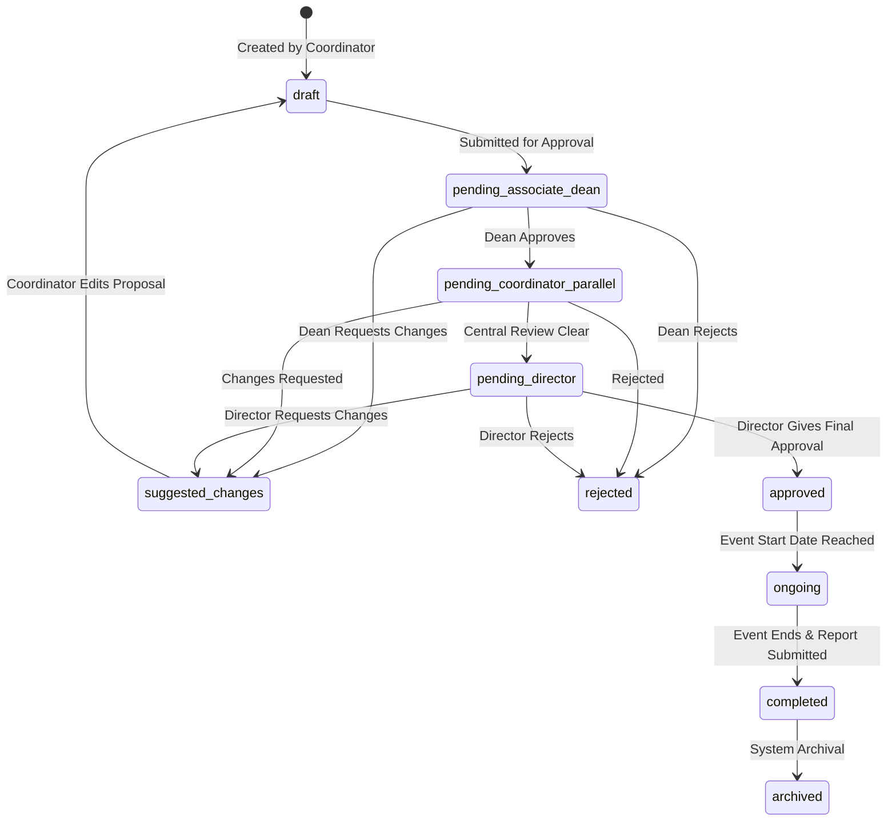
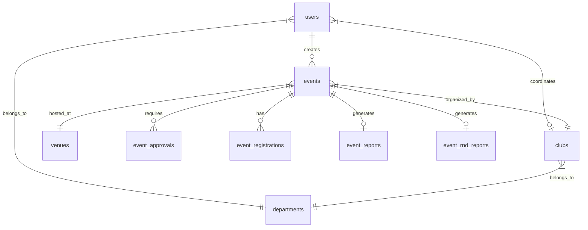

# 🏛️ EMS System Specification & Comprehensive Technical Reference

> **Version**: 6.0.0  
> **Target Audience**: Developers, System Administrators, QA Engineers  
> **Scope**: Complete reference for User Roles, Schools, Events, Approval Workflows, Database Schema, Frontend Pages, and REST APIs.

---

## 📋 Table of Contents
1. [User Roles & Permission Matrix](#1-user-roles--permission-matrix)
2. [Schools & Departments](#2-schools--departments)
3. [Event Architecture & Status Lifecycle](#3-event-architecture--status-lifecycle)
4. [Approval Workflow Engine](#4-approval-workflow-engine)
5. [Database Architecture & Data Models](#5-database-architecture--data-models)
6. [Frontend Application Structure & Page Directory](#6-frontend-application-structure--page-directory)
7. [API Endpoint Catalog](#7-api-endpoint-catalog)

---

## 1. 👤 User Roles & Permission Matrix

The application employs Role-Based Access Control (RBAC) supplemented by dynamic granular permissions for custom roles.

### User Roles (`UserRole`)

| Role | Key Scope & Capabilities | Primary Dashboard |
|---|---|---|
| `super_admin` | Full system control: manages users, clubs, departments, venues, global settings, email logs, and dynamic permission delegation. | `/admin` |
| `director` | Top-level academic authority: final approval/rejection step for institution-wide events, approval history tracking, and venue overview. | `/director` |
| `associate_dean` | School/Department head: first-level approval for department events, club oversight, venue bookings, and clash override flags. | `/associate_dean` |
| `club_coordinator` | Event creator: drafts and submits event proposals, uploads posters/documents, manages registrations, and submits Post-Event & R&D Reports. | `/club_coordinator` |
| `student` | Event attendee: browses active events, registers for college events, views registration history, and accesses venue calendars. | `/student` |
| `additional` | Dynamic/Custom role: access is driven dynamically via granular `extra_permissions` granted by `super_admin`. | `/additional` |

---

### Dynamic Permissions Catalog (`additional` Role)

| Permission Code | Category | Action Description |
|---|---|---|
| `view_events` | Events | View all events across schools/clubs |
| `view_event_details` | Events | View granular event requirements & documents |
| `view_reports` | Reports | View submitted post-event reports |
| `submit_reports` | Reports | Submit post-event financial & attendance reports |
| `view_rnd_reports` | R&D | View submitted R&D research & outcome reports |
| `submit_rnd_reports` | R&D | Submit R&D structured reports and upload fliers |
| `manage_permissions` | Security | Delegate dynamic permissions to additional role users |

---

## 2. 🏫 Schools & Departments

The system categorizes academic units into Schools/Departments:

| School / Department | Code | Overview |
|---|---|---|
| **MPSTME** | `ENGG` | Mukesh Patel School of Technology Management & Engineering |
| **SPTPS** | `PHARMA` | Shobhaben Pratapbhai Patel School of Pharmacy & Technology Management |
| **SAST** | `AGRI` | School of Agricultural Sciences & Technology |
| **Central Admin / Other** | `CENTRAL` | Institutional & Inter-departmental bodies |

---

## 3. 🎯 Event Architecture & Status Lifecycle

### Event Types (`EventType`)
* `technical` — Hackathons, tech symposiums, coding competitions
* `cultural` — Music, dance, drama, fest celebrations
* `sports` — Tournaments, athletics, intra/inter-college games
* `seminar` — Guest lectures, webinars, panel discussions
* `workshop` — Hands-on training sessions, bootcamps
* `hackathon` — Intensive building events
* `awareness` — Social drives, health awareness, blood donation
* `other` — Miscellaneous college gatherings

### Event Target Audience (`TargetAudience`)
* `college_wide` — Open to all students across all schools
* `engineering` — MPSTME students
* `agriculture` — SAST students
* `pharma` — SPTPS students

---

### Complete Event Status Lifecycle (`EventStatus`)

---

## 4. 🔄 Approval Workflow Engine

### Sequential & Parallel Approval Hierarchy
1. **Stage 1 — Proposal Submission (`draft` -> `pending_associate_dean`)**
   * The `club_coordinator` submits an event proposal specifying dates, venue requests, IT requirements, seating, food, budget, and posters.
2. **Stage 2 — Associate Dean Review (`pending_associate_dean`)**
   * The Associate Dean of the organizer's department reviews the proposal.
   * If approved, advances to `pending_coordinator_parallel`.
3. **Stage 3 — Parallel Coordinator Review (`pending_coordinator_parallel`)**
   * Central student activity/facility coordinators review venue availability and resource allocations (IT, Security, Catering).
   * Advances to `pending_director`.
4. **Stage 4 — Director Final Approval (`pending_director` -> `approved`)**
   * Final sign-off by the Director. Upon approval, venue allocation is locked, and the event becomes visible to students for registration.

### Venue Clash Detection & Overrides
* **Automatic Clash Detection**: The system checks `(venue_id, event_date, start_time, end_time)` against existing approved/pending events.
* **Clash Override**: Approvers (`associate_dean` or `director`) can check `venue_clash_override` and provide a mandatory reason to approve an event despite time overlaps.

---

## 5. 🗄️ Database Architecture & Data Models

Engineered with PostgreSQL and SQLAlchemy async/sync models.

### Table Definitions & Key Columns

#### `users`
* `id` (INT, PK, Auto)
* `email` (VARCHAR, Unique, Indexed)
* `name` (VARCHAR)
* `hashed_password` (VARCHAR)
* `role` (VARCHAR: `super_admin`, `director`, `associate_dean`, `club_coordinator`, `student`, `additional`)
* `department_id` (INT, FK -> `departments.id`, Nullable)
* `club_id` (INT, FK -> `clubs.id`, Nullable)
* `status` (VARCHAR: `active`, `inactive`)
* `is_first_login` (BOOLEAN, Default `True`)
* `sap_id`, `branch`, `year_of_study`, `course`, `phone_number` (VARCHAR, Profile details)
* `extra_permissions` (JSONB / TEXT, Extra permission tags for `additional` role)

#### `departments`
* `id` (INT, PK)
* `name` (VARCHAR)
* `code` (VARCHAR, Unique)

#### `clubs`
* `id` (INT, PK)
* `name` (VARCHAR)
* `description` (TEXT)
* `department_id` (INT, FK -> `departments.id`)
* `is_active` (BOOLEAN)

#### `venues`
* `id` (INT, PK)
* `name` (VARCHAR)
* `location` (VARCHAR)
* `max_capacity` (INT)
* `aliases` (VARCHAR)
* `department_id` (INT, FK -> `departments.id`, Nullable)
* `parent_id` (INT, FK -> `venues.id`, Nullable - for sub-rooms)
* `is_active` (BOOLEAN)

#### `events`
* `id` (INT, PK)
* `title` (VARCHAR)
* `event_type` (VARCHAR)
* `school_department` (VARCHAR)
* `event_incharge_name`, `event_incharge_contact` (VARCHAR)
* `target_audience` (VARCHAR)
* `is_club_event` (BOOLEAN), `club_id` (INT, FK)
* `event_date` (DATE), `start_time` (TIME), `end_time` (TIME)
* `venue_id` (INT, FK), `venue_custom` (VARCHAR)
* `seating_arrangement`, `tables_required`, `chairs_required` (VARCHAR)
* `it_projector`, `it_audio`, `it_wifi`, `it_laptop` (BOOLEAN)
* `food_items`, `beverage_items`, `pax_count` (INT/BOOLEAN)
* `budget` (FLOAT)
* `poster_path` (VARCHAR)
* `status` (VARCHAR: `draft`, `pending_...`, `approved`, `rejected`, etc.)
* `created_by` (INT, FK -> `users.id`)
* `current_approval_step` (INT)

#### `event_approvals`
* `id` (INT, PK)
* `event_id` (INT, FK -> `events.id`)
* `approver_id` (INT, FK -> `users.id`)
* `role_at_approval` (VARCHAR)
* `sequence_order` (INT)
* `status` (VARCHAR: `pending`, `approved`, `rejected`, `suggested_changes`)
* `remarks` (TEXT)
* `venue_clash_override` (BOOLEAN)
* `venue_clash_override_reason` (TEXT)
* `actioned_at` (TIMESTAMP)

#### `event_registrations`
* `id` (INT, PK)
* `event_id` (INT, FK -> `events.id`)
* `user_id` (INT, FK -> `users.id`)
* `student_email` (VARCHAR)
* `status` (VARCHAR: `registered`, `cancelled`)
* `registered_at` (TIMESTAMP)

#### `event_reports` & `event_rnd_reports`
* `event_id` (INT, PK, FK -> `events.id`)
* `event_summary`, `outcomes`, `issues`, `feedback` (TEXT)
* `actual_budget` (FLOAT), `participant_count` (INT)
* `attendance_doc_path`, `flier_path`, `generated_report_path` (VARCHAR)
* `is_submitted` (BOOLEAN)

---

## 6. 💻 Frontend Application Structure & Page Directory

Built with Next.js 14 (App Router) & Zustand State Management.

### All 34 Discovered Application Routes

#### Public Routes (3)
* `/` — Public landing page, overview, and features
* `/about` — Institution & system information
* `/events/[id]` — Publicly viewable event details & registration prompt

#### Authentication & Onboarding (5)
* `/login` — User authentication portal
* `/signup` — Student registration portal
* `/forgot-password` — Password recovery request
* `/change-password` — Mandatory password change interface
* `/complete-profile` — Mandatory student/coordinator onboarding profile builder

#### Super Admin Suite (10)
* `/admin` — System overview dashboard & metrics
* `/admin/users` — User management (Search, Filter, Pre-approve, Activate, Deactivate, Delete, Bulk Action)
* `/admin/clubs` — Institution club management
* `/admin/departments` — Department/school management
* `/admin/events` — Master event overview across all departments
* `/admin/venues` — Venue inventory management
* `/admin/permissions` — Additional role dynamic permission delegation
* `/admin/email-log` — System email notification log & audit trail
* `/admin/system-controls` — Global system toggles (registration disable, force login)
* `/admin/settings` — App configuration

#### Director Suite (5)
* `/director` — Executive approval dashboard
* `/director/events` — Pending institution-wide approvals
* `/director/history` — Historical approval log
* `/director/venues` — Venue availability overview
* `/director/documents` — Approved event document access

#### Associate Dean Suite (7)
* `/associate_dean` — School dashboard
* `/associate_dean/events` — Department event approvals
* `/associate_dean/history` — Department approval audit log
* `/associate_dean/clubs` — Department club management
* `/associate_dean/venues` — School venue schedule
* `/associate_dean/documents` — Department event repository
* `/associate_dean/overrides` — Venue clash override records

#### Club Coordinator Suite (6)
* `/club_coordinator` — Coordinator dashboard & stats
* `/club_coordinator/events` — My club's events list
* `/club_coordinator/events/create` — Multi-step event creation wizard
* `/club_coordinator/documents` — Uploaded posters & documents
* `/club_coordinator/report` — Post-event report submission
* `/club_coordinator/rnd-report` — R&D report submission & docx generation

#### Student Suite (4)
* `/student` — Student personalized dashboard
* `/student/events` — Event directory & registration button
* `/student/registrations` — My registered events & pass access
* `/student/venues` — Public venue schedule view

#### Additional Role Suite (5)
* `/additional` — Dynamic permission dashboard
* `/additional/events` — Permission-gated event viewer
* `/additional/reports` — Permission-gated report viewer
* `/additional/rnd-reports` — R&D report viewer & editor
* `/additional/permissions` — Permission management (if granted)

#### Shared Views (2)
* `/calendar` — Master visual venue availability calendar
* `/profile` — Personal account settings & details

---

## 7. 🔌 API Endpoint Catalog

All REST APIs run on FastAPI (`http://localhost:8000`) and are proxied via Nginx (`http://localhost:8080/api/`).

### Authentication (`/auth`)
* `POST /auth/login` — Authenticate email/password, return access & refresh JWTs
* `POST /auth/signup` — Student self-registration
* `POST /auth/refresh` — Issue new access token using refresh token
* `GET /auth/me` — Fetch currently authenticated user profile
* `POST /auth/change-password` — Change password (first-time or manual)
* `POST /auth/complete-profile` — Submit mandatory profile completion fields
* `POST /auth/forgot-password` — Request password reset email
* `POST /auth/reset-password` — Execute password reset with token

### User Management (`/users`)
* `GET /users/` — List users with role/status filters (Admin only)
* `GET /users/me` — Current user profile
* `PATCH /users/me` — Update user profile
* `GET /users/search` — Search users by email
* `GET /users/{id}` — Fetch specific user details
* `POST /users/pre-approve` — Pre-approve user email with pre-assigned role
* `PATCH /users/{id}/activate` — Reactivate user account
* `PATCH /users/{id}/deactivate` — Deactivate user account
* `DELETE /users/{id}` — Permanently delete user account
* `POST /users/bulk-action` — Unified bulk activate/deactivate/delete

### Departments (`/departments`)
* `GET /departments/` — List all departments
* `GET /departments/{id}` — Get department details
* `POST /departments/` — Create new department (Admin only)
* `PUT /departments/{id}` — Update department details
* `DELETE /departments/{id}` — Remove department

### Clubs (`/clubs`)
* `GET /clubs/` — List all clubs
* `GET /clubs/{id}` — Get club details
* `POST /clubs/` — Create new club (Admin only)
* `PUT /clubs/{id}` — Update club details
* `DELETE /clubs/{id}` — Delete club

### Venues (`/venues`)
* `GET /venues/` — List all venues
* `GET /venues/{id}` — Get venue details
* `POST /venues/` — Create new venue (Admin/Dean only)
* `PUT /venues/{id}` — Update venue details
* `DELETE /venues/{id}` — Delete venue

### Events (`/events`)
* `GET /events/` — List events with filters (type, status, department, search)
* `GET /events/{id}` — Get complete event specification
* `POST /events/` — Create draft event proposal (Coordinator only)
* `PUT /events/{id}` — Update event details (before final approval)
* `DELETE /events/{id}` — Cancel/delete event
* `POST /events/{id}/register` — Register for event (Student only)
* `POST /events/{id}/cancel-registration` — Cancel student event registration
* `POST /events/{id}/upload-poster` — Upload event poster image

### Approval Engine (`/approvals`)
* `GET /approvals/pending` — Fetch events waiting for current user's approval
* `GET /approvals/{event_id}/history` — Audit trail of approvals for an event
* `POST /approvals/{event_id}/approve` — Approve event (with optional clash override)
* `POST /approvals/{event_id}/reject` — Reject event with mandatory remarks
* `POST /approvals/{event_id}/suggest-changes` — Request modifications from coordinator

### Post-Event & R&D Reports (`/reports` & `/rnd-reports`)
* `POST /rnd-reports/{event_id}/submit` — Submit structured JSON R&D report
* `POST /rnd-reports/{event_id}/upload-flier` — Upload mandatory event flier
* `POST /rnd-reports/{event_id}/upload-photos` — Upload event photo gallery
* `POST /rnd-reports/{event_id}/upload-attendance` — Upload attendance sheet
* `GET /rnd-reports/{event_id}/generate` — Generate and download `.docx` R&D report
* `GET /rnd-reports/{event_id}` — Get R&D report metadata

### Permission Engine (`/permissions`)
* `GET /permissions/catalog` — Get all available dynamic permission codes
* `GET /permissions/users` — List all `additional` role users and their permissions
* `PUT /permissions/{user_id}` — Overwrite permissions for an additional user
* `POST /permissions/{user_id}/grant` — Grant specific extra permissions
* `DELETE /permissions/{user_id}/revoke` — Revoke specific extra permissions

### System Controls (`/system`)
* `GET /system/settings` — Get global system configurations (Admin only)
* `GET /system/settings/public` — Get public system flags (registration toggles)
* `PATCH /system/settings` — Update system behavior settings
